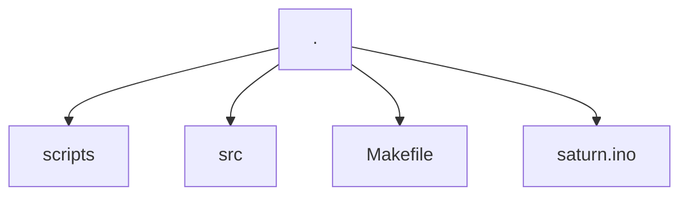
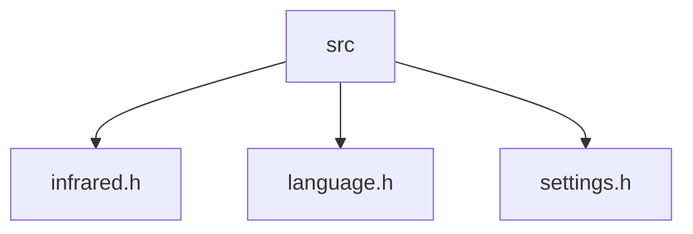

<h1>
  <a href="https://github.com/henriquesebastiao/saturn/" target="blank"></a>
</h1>

[](https://github.com/henriquesebastiao/saturn/actions/workflows/ci.yml)
[](https://github.com/henriquesebastiao/saturn/actions/workflows/build.yml)
[](https://github.com/henriquesebastiao/saturn/tags)
[](https://github.com/henriquesebastiao/saturn/blob/main/LICENSE)

<p>
  Saturn aims to be a simple and functional firmware that implements several functionalities for vulnerability analysis and even simple day-to-day tasks that can be performed with an ESP32.
</p>

<p>
  
</p>

### Credits

If you read the source code you will see that it contains many things similar to the [Nemo](https://github.com/n0xa/m5stick-nemo) project, this is because many things are borrowed from there. I just added some irrelevant things, changed the color and added rounded corners.

Nemo project: https://github.com/n0xa/m5stick-nemo

Other sources were also borrowed:

#### IR codes

- https://www.remotecentral.com/cgi-bin/codes/
- https://github.com/probonopd/lirc-remotes

#### Sounds

- https://github.com/hibit-dev/buzzer/tree/master
- https://github.com/henriquesebastiao/RouterBOARD-Scripts

### An advance warning

This project is still in its initial phase and is being developed for my own learning, therefore, it may not generate the expected result at some point. The code is still under development and may contain bugs and flaws. If you find something that doesn't seem to be working correctly, don't hesitate to open an issue reporting the error you experienced. I will do my best to help you.

## Features

### Infrared

Implementation of the main remote control buttons for some types of devices.

#### Devices supported

- TVs (Samsung, Philips, Toshiba)

> Currently, tests have only been carried out on a Samsung TV. Contributions are welcome to add support for new manufacturers and devices.

#### Buttons implemented

- `POWER`
- `MUTE`
- `VOLUME_UP`
- `VOLUME_DOWN`
- `MENU`
- `CHANNEL_UP`
- `CHANNEL_DOWN`
- `UP`
- `DOWN`
- `LEFT`
- `RIGHT`
- `ENTER`

### Wi-Fi


- Signal Level (with feedback beep sounds)
- Beacon Attacks
  - Funny SSIDs (en-US)
  - Funny SSIDs (pt-BR)
  - Random SSIDs
- Deauth Attack
- Portal Clone
- Deauth + Portal Clone

### Bluetooth

- AppleJuice
- Swift Pair
- Android Spam
- SourApple Crash
- BT Maelstrom

### Sounds

Musics played with beep sounds.

- `Mario Bros`
- `Crazy Train`
- `Imperial March`
- `Aha Take On Me`
- `Jingle Bells`
- `Star Wars`
- `Nokia Ringtone`
- `The Simpsons`
- `Pacman`
- `DOOM`
- `Shape of You`
- `Game of Thrones`

### Voice Recorder

Record your voice and play it back.

## How to install

Saturn has different compilation versions, versions with different languages ​​(pt-BR, en-US) and "silent" versions. The compiled silent versions present in GitHub releases are named with the suffix `silent`, they do not emit any sound during firmware execution.

### Install from M5Burner

This is the absolute easiest way to get Saturn

- Launch M5Burner.
- Select "Cardputer" from the menu on the left.
- Use the search at the top of the app to look for "Saturn". My official builds will be uploaded by "henriquesebastiao" and have photos.
- Click Download.
- Click Burn.

### Install `.bin` files manually with `esptool.py`

- Install ESP-IDF tools per the [Espressif Getting Started Guide](https://docs.espressif.com/projects/esp-idf/en/latest/esp32/get-started/)
- Open the `esp-idf` CMD tool (on Windows) - on Mac or Linux, `esp-idf.py` and `esptool.py` should be in the system path.
- `esptool.py --port COMPORT -b 115200 write_flash -z 0x0 Saturn-VERSION.bin`
  - port may be a COM port e.g. `COM4`, `COM11` on Windows. On Mac and Linux it will usually be in `/dev` such as `/dev/ttyUSB0`, `/dev/ttyACM0` or `/dev/cu.usbserial-3`
  - `Saturn-VERSION.bin` should be a version you downloaded from a GitHub Release -- preferably the latest available.

## Building from Source

If you want to customize Saturn or contribute to the project, you should be familiar with building Saturn from source.

- Install Arduino IDE. I've used Arduino 2.3 on Arch Linux successfully.
- Install the M5Stack boards for Arduino IDE: In File -> Preferences, paste this URL into the "Boards Manager URLs" text box. Use commas between URLs if there are already URLs present.  https://m5stack.oss-cn-shenzhen.aliyuncs.com/resource/arduino/package_m5stack_index.json
- If M5Stack -> M5Cardputer doesn't show up under Tools -> Boards, then use Tools -> Boards -> Boards Manager and search for M5Stack. This will install support for most of the M5Stack boards including the Cardputer.
- Install necessary libraries. In Sketch -> Include Library -> Library Manager, search for and install the following libraries and any dependencies they require:
  - M5Cardputer
  - IRRemoteESP8266
- Switch partition schemes. `Tools` -> `Partition Scheme` -> `No OTA (Large APP)` - sometimes this option is labeled `Huge APP`
- Configuration
  - The code should compile cleanly and work on an M5Stick C Plus out of the box from the main branch or a release tag.
  - Uncomment only the one appropriate `#define` option or compiler errors will occur. 
- Compile and upload the project


### Compile it yourself (with Arduino CLI)

- Install Arduino CLI
- Add M5Stack Index to Arduino Core
- Add M5Stack Libraries

```bash
# Install m5stack boards
arduino-cli core install m5stack:esp32  --additional-urls https://m5stack.oss-cn-shenzhen.aliyuncs.com/resource/arduino/package_m5stack_index.json --log-level warn --verbose

# Install required library
arduino-cli lib install M5Cardputer --log-level warn --verbose

# Compile
arduino-cli compile --fqbn m5stack:esp32:m5stack_cardputer -e --build-property build.partitions=huge_app --build-property upload.maximum_size=3145728 ./saturn.ino
```

- This will create multiple binaries based on partition sketch, you can merge a single binary using `esptool`
- Install esptool `pip install -U esptool`

```bash
esptool.py --chip esp32s3 merge_bin --output final.bin 0x0000 saturn.ino.bootloader.bin 0x8000 saturn.ino.partitions.bin 0x10000 saturn.ino.bin
```

- You can now flash the merged binary firmware using `esptool`

```bash
esptool.exe write_flash -z 0 final.bin
```

## Reporting Bugs

Please report bugs via GitHub Issues. These are easier to track than comments on social media posts, comments on M5Burner, etc. If something isn't working, please include:

- Firmware version
- How you installed it (M5Burner, compiled yourself, esptool.py)
- Specifically what feature and options are not working
- How you determined that it is not working and what testing you did. Include device models and operating systems of what you tested with, and any errors or relevant output from Serial Monitor, if applicable.
- If you figure out how to fix a bug you identified, PRs are welcome!

## Contributing

If you want to contribute to this project, you can open a pull request with the changes you made. I will be happy to review your code and merge it into the main branch if it is in accordance with the project's objectives.

- When submitting a pull request, target the development branch. The easiest way to do this is to create a `dev` branch on your own fork and then use GitHub to sync your develop branch.
- See that certain variables are defined in the code, try to follow these standards. As is the case with `MAIN_COLOR`, `BG_COLOR`, `DISPLAY` among others. Also follow the project organization structure.

Things I'd like help on:

- Testing on different devices and reporting your feedback.
- Infrared
  - Add support for new manufacturers and also new device types, such as air conditioners, sound systems, etc.

### How the project is organized?

**Directory structure**



The project is organized as follows:

- `scripts`: Contains scripts to format the code present in `src/infrared.h` and perform some interesting tasks during development.
- `src`: Contains the project's source code, where the things that the `.ino` file consumes are implemented.
- `Makefile`: Contains commands that can be used to automate some tasks, such as compiling and uploading firmware to Cardputer.
- `saturn.ino`: Main file of the project, where the main functionalities are called.

#### `src` directory



The `src` directory contains the following files:

- `infrared.h`: Contains IR codes for the most varied devices.
- `language.h`: Contains the translations of the messages that are displayed on the screen.
- `settings.h`: Contains settings that can be changed by the user, such as the language used in messages, colors, text size, etc.

## License

This project is licensed under the GPL-3.0 License - see the [LICENSE](LICENSE) file for details.

## Disclaimer

The functionalities present in this firmware are for educational purposes only, being tested only in controlled and isolated environments. The maintainers are not responsible for any misuse of this tool.