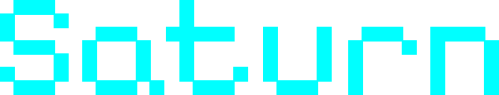

    

<i>Firmware to do cool things with Cardputer.</i>

    
    
    
    

Saturn aims to be a simple and functional firmware that implements several functionalities for vulnerability analysis and even simple day-to-day tasks that can be performed with an Cardputer.

### Credits

If you read the source code you will see that it contains many things similar to the [Nemo](https://github.com/n0xa/m5stick-nemo) project, this is because many things are borrowed from there. I just added some irrelevant things, changed the color and added rounded corners.

Nemo project: [https://github.com/n0xa/m5stick-nemo](https://github.com/n0xa/m5stick-nemo)

Other sources were also borrowed:

#### IR codes

- [https://www.remotecentral.com/cgi-bin/codes/](https://www.remotecentral.com/cgi-bin/codes/)
- [https://github.com/probonopd/lirc-remotes](https://github.com/probonopd/lirc-remotes)

#### Sounds

- [https://github.com/hibit-dev/buzzer/tree/master](https://github.com/hibit-dev/buzzer/tree/master)
- [https://github.com/henriquesebastiao/RouterBOARD-Scripts](https://github.com/henriquesebastiao/RouterBOARD-Scripts)

!!! info "An advance warning"

    This project is still in its initial phase and is being developed for my own learning, therefore, it may not generate the expected result at some point. The code is still under development and may contain bugs and flaws. If you find something that doesn't seem to be working correctly, don't hesitate to open an issue reporting the error you experienced. I will do my best to help you.
